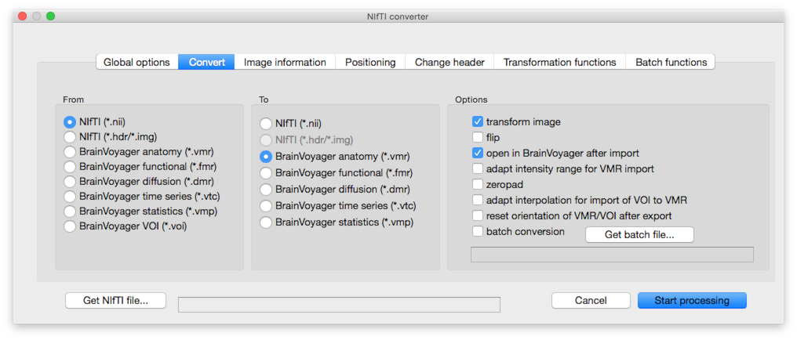
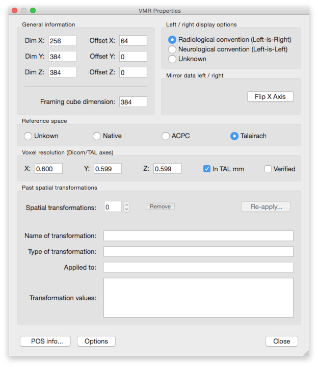
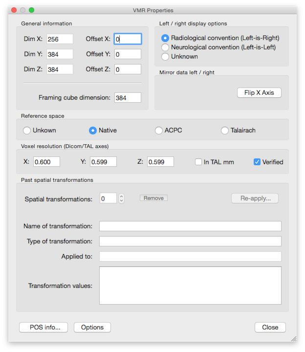
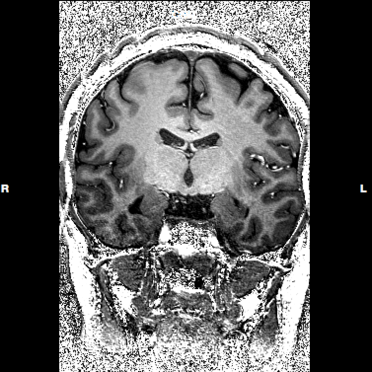
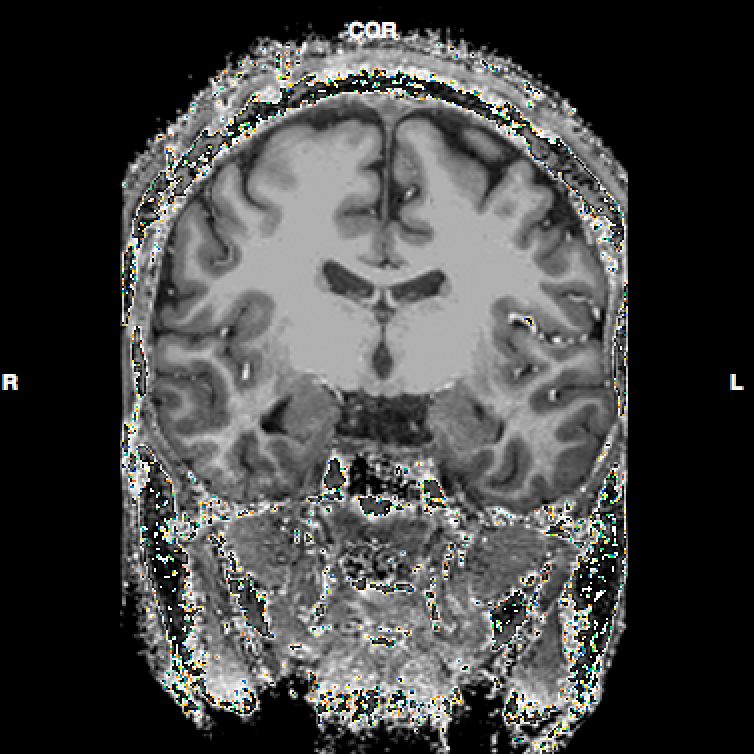

# Freesurfer recon-all pipeline for 7T data

Thomas Emmerling - Maastricht University

This bash script makes use of the Freesurfer 5.3 recon-all pipeline (https://surfer.nmr.mgh.harvard.edu/fswiki/ReconAllDevTable) for creating volume segmentations and surface reconstructions from anatomical DICOMs. However, in contrast to the standard recon-all pipeline it is optimized for __sub-millimeter resolution data coming from (*e.g.*) 7T scanners__. It relies heavily on the work of Falk Lüsebrink (https://surfer.nmr.mgh.harvard.edu/fswiki/HiResRecon, http://www.ncbi.nlm.nih.gov/pubmed/23261638). If wanted, the script will automatically pause and notify you via mail to let you check the Talairach transformation and the skull stripping. It will also offer some automatic correction options. Furthermore it converts some output files to the NIfTI format with intensity values optimized for usage in BrainVoyager QX (http://www.brainvoyager.com/).

## UPDATE: Freesurfer v6b
[Ed Gronenschild](mailto:ed.gronenschild@maastrichtuniversity.nl) has contributed some experiences on segmenting 7T MP2RAGE anatomicals in Freesurfer v6b:
- crop INV2 and UNI images by removing the neck
- use BET (option `-AR -f 0.2`) to skullstrip INV2
- use outer skull mask of INV2 to clean UNI
- run `recon-all -autorecon1` with correction for nun-uniformities (`nu-correct`) with only one iteration (I have the impression that option `-nouintensitycor` doesn't work, so I supplied an expert options file with text: `mri_nu_correct.mni --proto-iters 1 --distance 25 --n 1 --fwhm 0.15`). Took about 25 min on MacPro
- manually edit brainmask.mgz
- run `recon-all -autorecon2 -autorecon3`. Took 30 - 35 hours on MacPro

## Features
- fully configurable via textfile
- automatic pausing at critical steps that require inspection (+ guided interaction)
- script saves the current processing stage for every dataset (so that it can continue from there if the processing was interrupted)
- mail notification of progress and if interaction is required
- possibility to run multiple subjects in batch
- possibility to run multiple subjects in parallel (if scripts is invoked multiple times in different terminals with different configuration files)

## Installation
For installation instructions for Freesurfer, please look at https://surfer.nmr.mgh.harvard.edu/fswiki/DownloadAndInstall

If you want to make use of GPU acceleration, make sure to install current CUDA drivers
(for OSX: http://www.nvidia.com/object/mac-driver-archive.html)

If mail notifications should be used please get a (free) account at Mandrill (https://mandrill.com/signup/). Make sure to check the section for mail notification in the settings (especially the API key).

## Folder structure
This script assumes that there is a data folder with subfolders for every subject (named as written in the ```SUBJECTS``` variable in ```example-settings.txt```) and a subfolder "rawData" with in turn two subfolders "anatomy" and "pd" with the DICOM files inside.

```
└── dataFolder
    ├── subject1
    │   ├── dataAnalysis
    │   └── rawData
    │       ├── anatomy
    │       └── pd
    └── subject2
        ├── dataAnalysis
        └── rawData
            ├── anatomy
            └── pd
```

## Settings
Parameters for the pipeline can be set in a text file. Please look at ```example-settings.txt``` for a sample configuration file. Please note that it is possible to specify an array of subjects in the script so that data from several subjects are processed in batch mode.

## Usage
You can start the script with ```bash fs-recon-7T.sh example-settings.txt``` where ```example-settings.txt``` should be the settings file that you want to use.

## Notes
If you use GPU acceleration please note that parallel execution of the script with different setting files is not advisable as the CUDA interface can probably not be used by two processes at the same time (at least I did not try that...).

## Import to BrainVoyager QX
If the ```flag_backTransform``` flag is true (see settings for more options), the script outputs several files to an autmatically create ```fs``` folder inside the subject directory that can easily be imported with the NIfTI plugin (v1.09) for BrainVoyager QX with the following settings:


After the import, please check the VMR header (```File -> VMR properties```) and make sure to match it to a normally created VMR (*i.e.* change to offset, reference space, and voxel resolution settings:

before                           |  after
:-------------------------------:|:-------------------------------:
| 

# Output files
The following files are created and can be imported into BrainVoyager QX as described above.

### Inhomogeneity-corrected anatomy

This file is saved as ```subject1_divPD.nii``` (where 'subject1' corresponds to the given subject name).
The following screenshots show the difference of the inhomogeneity correction:

without correction                           |  with correction
:-------------------------------:|:-------------------------------:
| 

to be continued...
